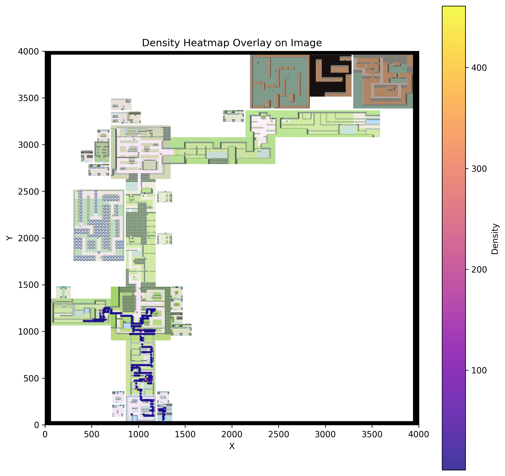

# Improving DQN Exploration in Pokémon

## Introduction
Some algorithms developed in the field of deep reinforcement learning aimed at training an agent capable of playing video games can sometimes be inefficient. For complex games like Pokémon or MONTEZUMA’S REVENGE, traditional methods may struggle to maintain a high level of exploration over extended gameplay or to choose when to explore new areas or situations. In such cases, it's often necessary to enhance exploration incentives for the agent to learn how to navigate its environment effectively. In this project, we focused on incorporating a GAN, specifically the discriminator part of a GAN trained on images encountered during agent training, to study its impact on the behavior of a DQN agent.

## Methodology
### Pokémon Environment
The Pokémon environment was created using the PyBOY emulator, which allows emulation of the game from a .rom file on a PC. Each state in the environment consists of a screenshot of the game reduced to a size of 120x120 pixels and a vector containing information such as Pokémon health points ratio, sum of Pokémon experience, number of badges obtained, and number of different captured Pokémon.

### DQN Implementation and Training
Initially, we implemented the DQN algorithm from scratch using PyTorch. The input to the DQN consists of a memory of 4 frames, where each frame is a grayscale screenshot of the current state and the three previous states. We also implemented a Replay Buffer for training the network. Subsequently, we switched to using RLlib, a reinforcement learning library that provides more optimization and flexibility. RLlib allows for multi-agent training and more efficient implementation of the Replay Buffer.

### GAN Implementation and Training
The GAN was implemented to train a classifier for "novelty" in an unsupervised manner. Images encountered during DQN training were used to train the GAN to generate game images.

### DQN + GAN Implementation and Training
We integrated the GAN into the DQN framework to improve exploration. A custom DQN class was created, inheriting from the DQN algorithm and the DQNTorchPolicy, to incorporate GAN exploration. The agent's behavior was modified based on the discriminator's classification of whether a state is "new" or not.

## Metrics and Results
To evaluate our agent's exploration, we used heatmaps to see how the a agent interacted in his environment during training as oresented in the following map : 

    

## Future Improvements
1. **Enhancing GAN Discriminator Performance**: Increase the size of the experience database and explore methods to improve convergence.
2. **Improving DQN by Transitioning to a CNN**: Transitioning to a convolutional neural network may improve agent performance as the classic DQN we used in RLLib is only a one hidden layer NN.
3. **Optimizing RLlib Hyperparameters using the Tune Class**: Utilizing hyperparameter optimization techniques provided by RLlib's Tune class.
4. **Increasing Iterations per Agent**: Improve DQN performance by increasing the number of training iterations.